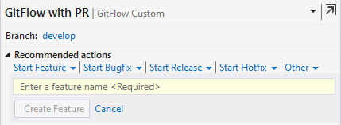
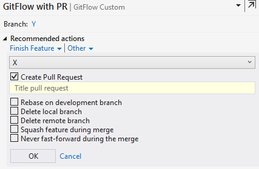
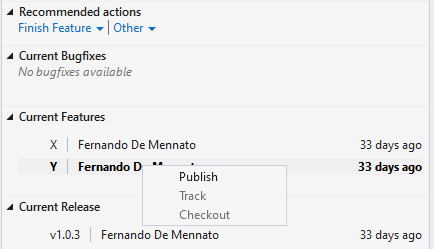

# GitFlow for Visual Studio 2019

Forked from https://github.com/jakobehn/GitFlow.VS

### Features 
This Team Explorer extension integrates GitFlow with PullRequest into your development workflow. It lets you easily create and finish feature, release and hotfix branches right from Team Explorer. 

It exposes the most common GitFlow options when finishing branches, such as options to delete branches, rebase on development branch and tagging of release branches.

### Prerequirements
The extension requires Visual Studio 2019 (it's also available for VS2017 and VS2015). It will install GitFlow and azure-cli for you. Since GitFlow with PR depends on Git for Windows, this must be installed before using the extension 
 

## Screenshots

### Initialize repo for GitFlow

### Start New Feature

### Finish Feature

### List of current features

